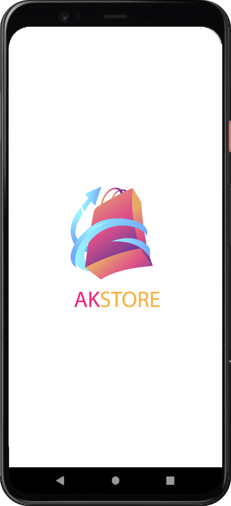
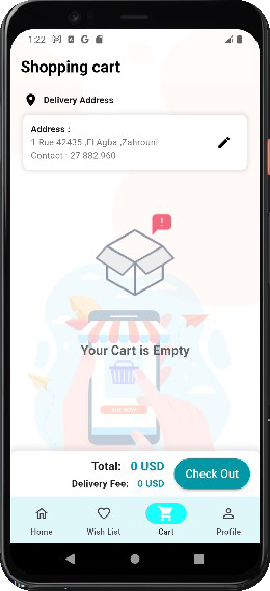
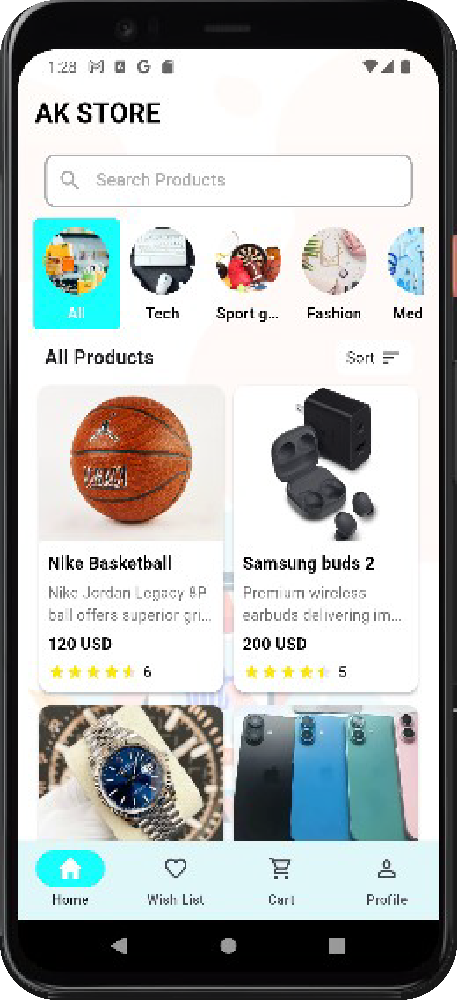
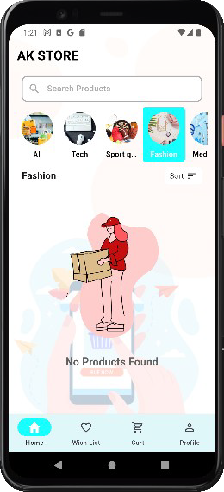
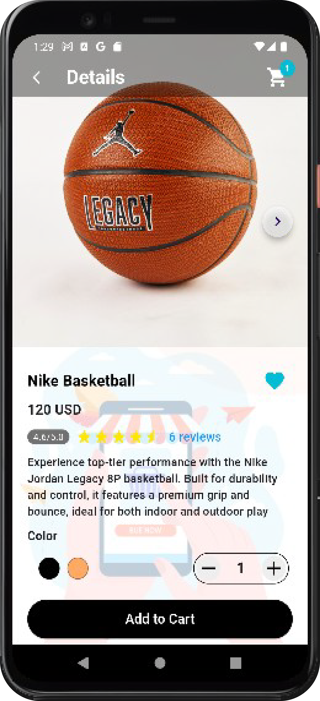
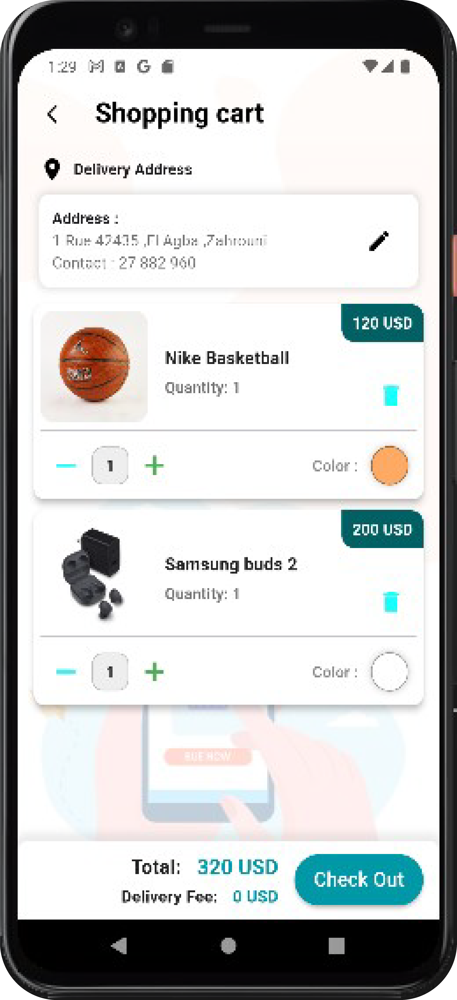
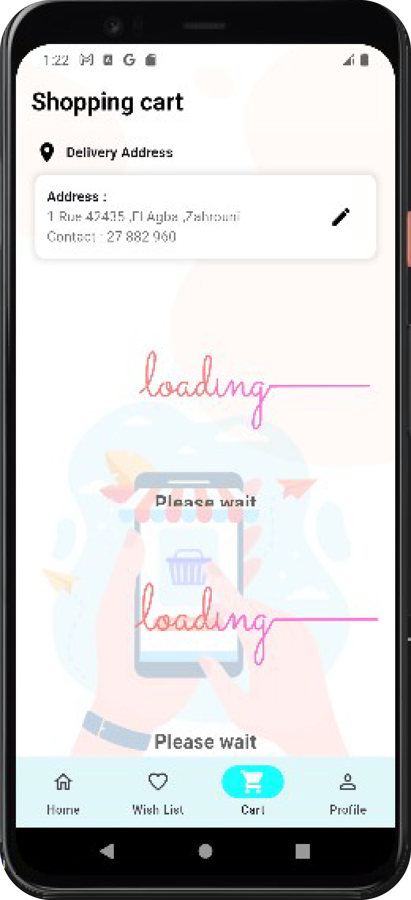
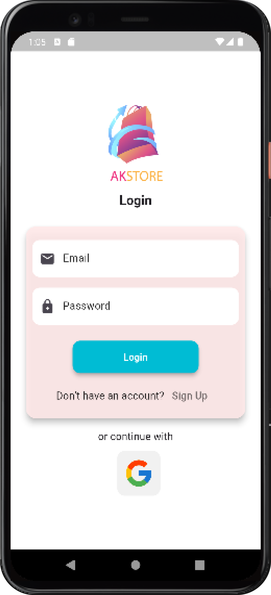
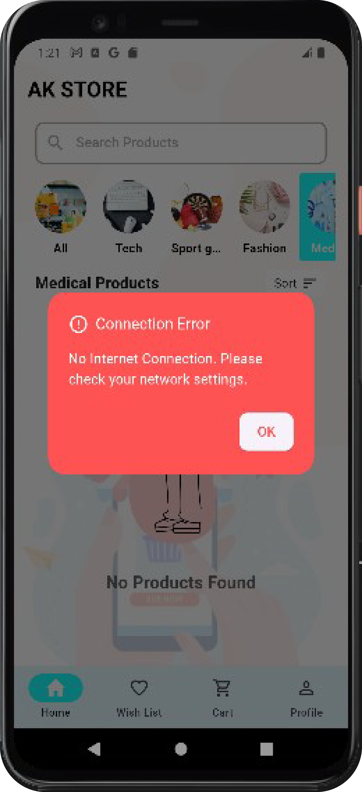

# 🛍️ AK-STORE

## 📌 Key Features:

- **Product Catalog**: Browse an extensive catalog of products, with detailed descriptions, images, and prices.
- **Search and Filter**: Easily search for products or filter them based on categories, price range, or brand.
- **User Accounts**: Create and manage user accounts, track orders, and save favorite items.
- **Shopping Cart**: Add items to the shopping cart, view item details, and proceed to checkout smoothly.
- **Wish List**: Add items users wish to buy in the future. easier in keeping a track of favorite items, their prices and stocks.

## 💻 Tech Stack:

- **Frontend**: Flutter
- **Backend**: Firebase for user authentication, database
- **Dependency Packages**: get, provider, connectivity plus, lottie, native splash, firestore, firebase core, google sign in

## Screenshots

    
    
    
    
    
    
    
    
    
    

